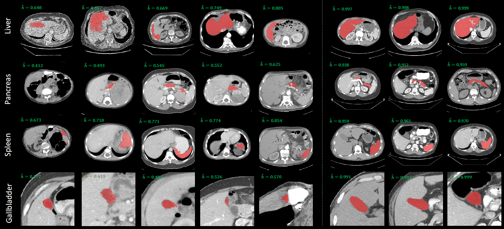
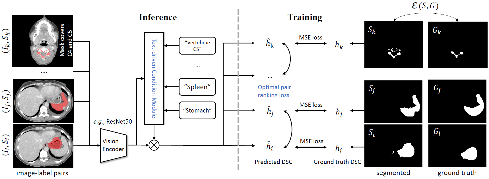
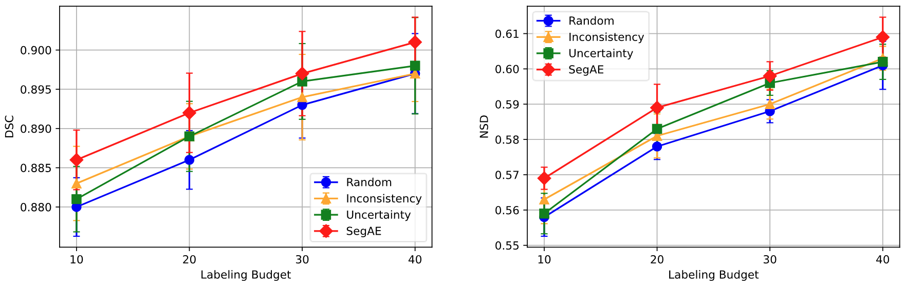

# Segmentation Assessment Engine
This is the repository of SegAE, a label (mask) quality assessment tool for pan-organ image segmentation, implemented with PyTorch. 
- Below shows labels with lower (left) and higher (right) predicted DSC in AbdomenAtlas dataset. 
- This model helps to diagnose the data quality in a large-scale CT image segmentation dataset.



### 1. Brief Introduction of this method

**Model input**: an image-label pair. The image is a 2D CT slice, the label is a binary mask.

**Model output**: estimates DSC of the mask to ground truths.

Two technical novelties:

1. The text-driven condition module embeds the organ names, serving as the conditional input of the model to recognize 142 different organs and improving the model performance.
2. The training of the model involves a compositional loss, combining optimal pair ranking and MSE, to align predicted with actual DSC.

### 2. Framework for SegAE

(1) Training Framework



(2) Dataset Construction

Both the training and testing data are drawn from the DAP Atlas dataset featuring 142 organs. We fine-tuned the pretrained [STUNet](https://github.com/uni-medical/STU-Net) on the [DAP Atlas](https://github.com/alexanderjaus/AtlasDataset). Model checkpoints were saved at specified epochs: 10; 20; 30; 40; 50; 100; 200; 300; 400; 500. From each checkpoint, pseudo labels were generated, creating a dataset of CT scans paired with pseudo labels of varying quality and their corresponding ground truth DSC.

### 3. Quick Start

The SegAE dataset and the trained model are shared in ([Google Drive](https://drive.google.com/drive/folders/1bMDSVSDB3Qv-6IhMaFloVdXZ52QP2V9X?usp=sharing)). After downloading the zipped dataset, unzip it to this directory directly.

#### 3.1 Train the model

Run

```
python train.py
```

and it would read the data from ./SegAE_data_50samples and save the model as best_resnet50_model_40_samples.pth.

#### 3.2 Inference on the TotalSegmentator dataset

Download TotalSegmentatorV1.0 dataset from [Zenodo](https://zenodo.org/records/6802614). Unzip the Totalsegmentator_dataset.zip to this directory directly, and run

```
python inference_TotalSegmentator.py
```

#### 3.3 Code for inference on a single 3D image-label pair

Follow the code below to do inference. The correspondence between \[_class\] and text embedding is in the [DAP_Atlas_label_name.csv](./DAP_Atlas_label_name.csv).

```
from segae import segae_inference

# ct_slice is a CT volume ([D, H, W], numpy ndarray) of original HU values
# pred_mask_slice is the 0/1 mask ([D, H, W], numpy ndarray) of the target
# find the text embedding of your target, _class is an integer key
dsc = segae_inference(ct_data, mask_this_class, _class)
```


### 4. Results for SegAE

(1) The scatter plot of ground truth and predicted DSC on testing data, the high linear correlation coefficient demonstrates the performance of the model. 


(2) Human-in-the-Loop (active learning) results of label quality ranking methods on the TotalSegmentator. SegAE helps to reduce annotation costs, or improve the data efficiency.



(3) Semi-supervised learning results of label quality ranking methods on the TotalSegmentator. SegAE outperforms all alternatives. It also significantly reduces quality estimation costs (6 times less time, 60 times less RAM, and 20,000 times less disk space compared to MC dropout) by employing a 2D model that evaluates only the output mask slices instead of extensive 3D computation.


### 5. Environment

The code is developed with Intel Xeon Gold 5218R CPU@2.10GHz and 8 Nvidia Quadro RTX 8000 GPUs.

The install script requirements.txt has been tested on an Ubuntu 20.04 system.


